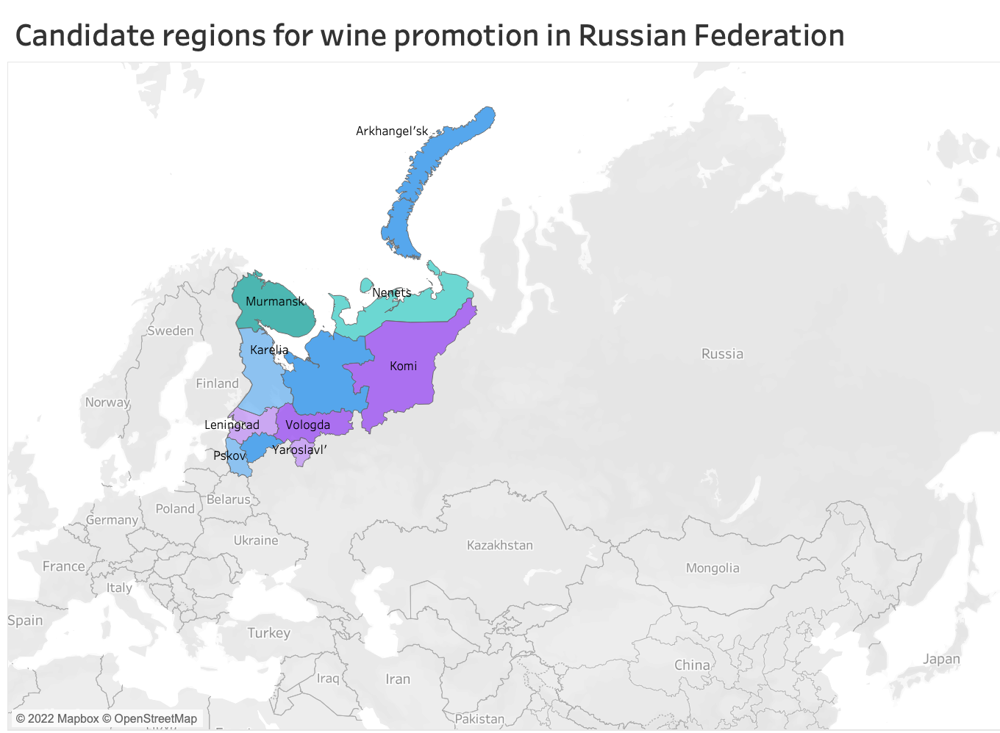
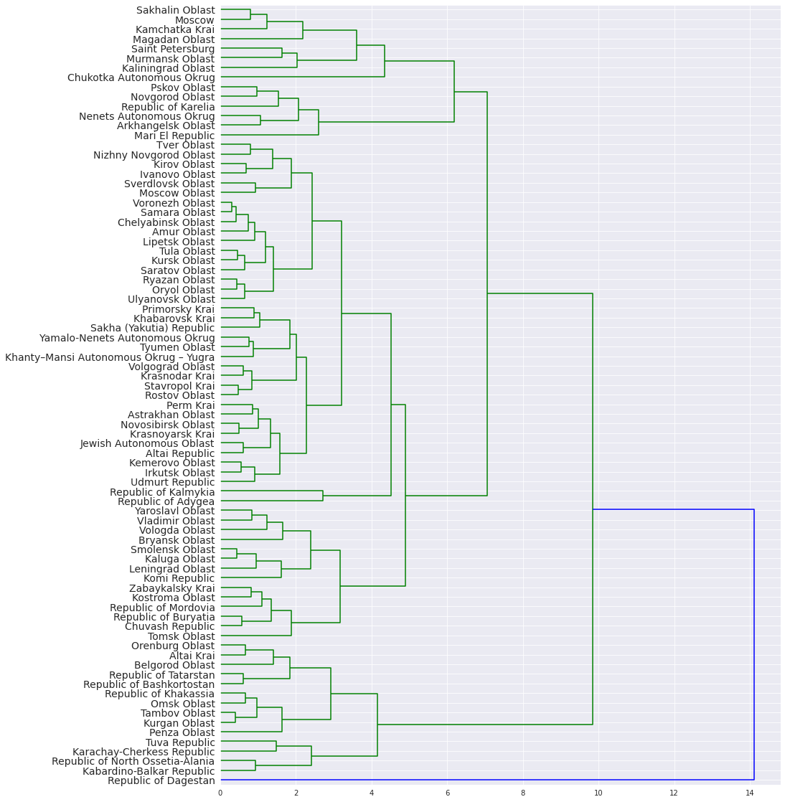

# Wine Strategy Russia

One famous Russian liquor company owns a chain of stores across Russia that sell a variety of alcoholic drinks. The company recently ran a wine promotion in Saint Petersburg that was very successful. Due to the cost of the business, it isn’t possible to run the promotion in all regions. The marketing team would like to target 10 other regions that have similar buying habits to Saint Petersburg where they would expect the promotion to be similarly successful.

What have I done?

* Conducted exploratory data analysis to catch drinking trends and correlation.
* Performed hierarchical clustering to find similar drinking patterns as the target region (in this case: Saint Petersburg).
* Improved clustering performance using PCA and t-SNE.
* Visualized top 10 candidates using Tableau.

## За здоровье!

## Hierarchical Clustering Example

